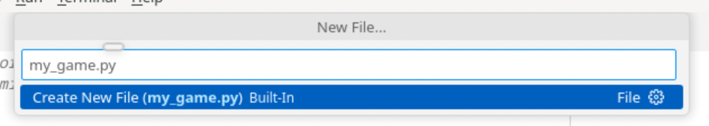
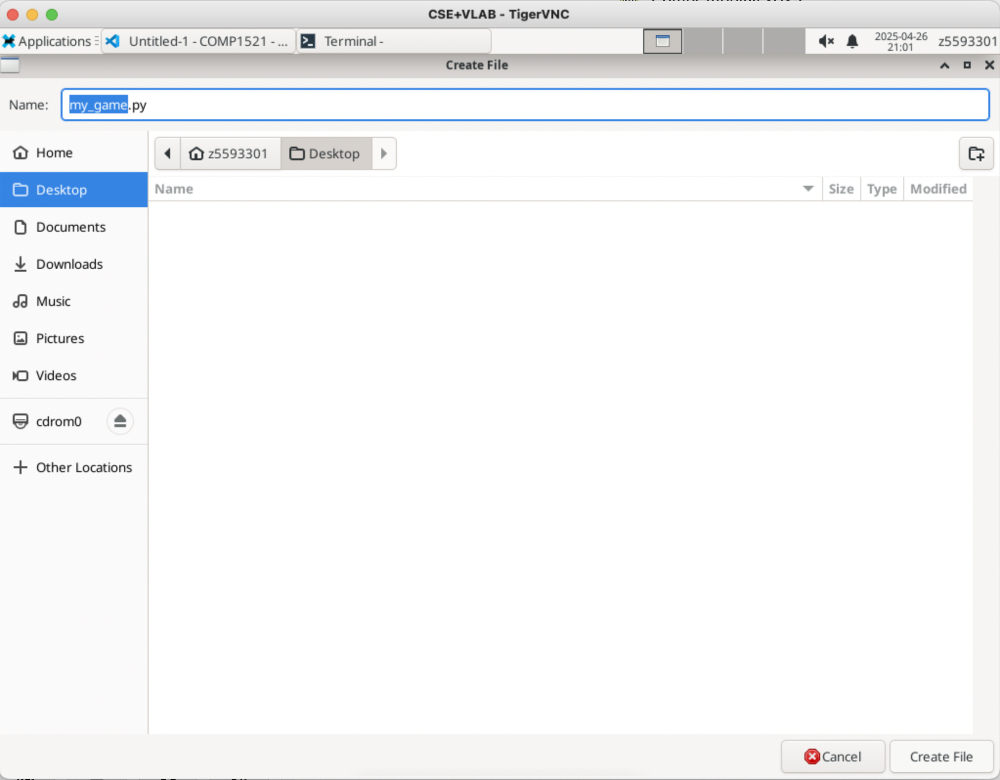

# Task 0.2: Make Python File

Now that you have VS Code open, it’s time to create your Python file!

In VS Code, click on **File**

    

and then New File...
    

You should see something like this pop up after you cilck 'New File'
    

Enter the name of your file (e.g. 'my_game.py')
    
    <span style="font-size: 24px;">```
    NOTE:  
        It’s super important to include **`.py`** at the end of the file name so VS Code knows it's Python code!
    ```</span>


Press **'ENTER'** and something looks like this should pop up
    

Press **'Desktop'** and then **'Create File'** to save your file to the Desktop
     


**AND NOW YOU HAVE CREATED YOUR PYTHON FILE!!! YOU CAN START CODING**


