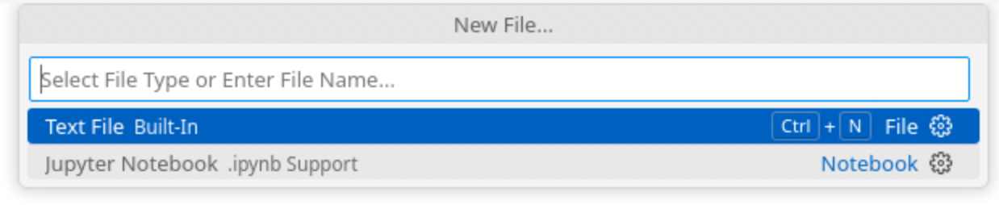

# Task 1.1: Make Python File

1. In VS Code, click on **File** and then **New File...**

    

    

    You should see something like this pop up **after you cilck 'New File'**
    

2. Enter the name of your file (e.g. 'my_game.py')
    

    <span style="font-size: 24px;">```
    NOTE:  
        It’s super important to include **`.py`** at the end of the file name so VS Code knows it's Python code!
    ```</span>


3. Press **'ENTER'** and something looks like this should pop up
    

4. Press **'Desktop'** and then **'Create File'** to save your file to the Desktop
     


5. **AND NOW YOU HAVE CREATED YOUR PYTHON FILE!!! YOU CAN START CODING**


