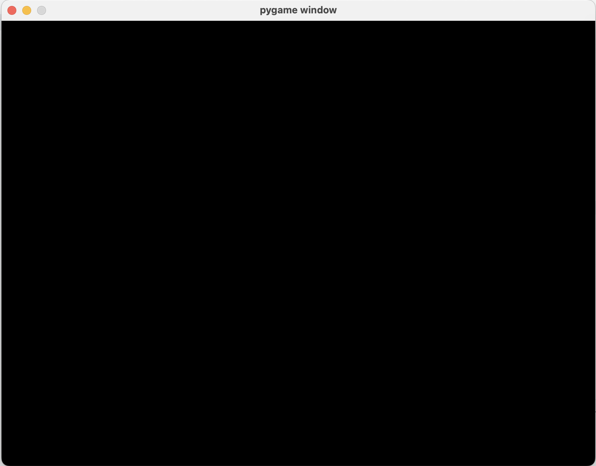

# Task 2.2: Create Game Loop
1. Use a variable called **`running`** and set it to **True** at the start
2. Then you need a **while** loop which **keep looping while the game is running**.
3. Inside your `while running:` loop, you need to **check what the player is doing**.
    ### Hint:
    - Use `for event in pygame.event.get():`
    - Go through all the events (like mouse clicks, window close, etc.)
    - If the player close the game (event.type == pygame.QUIT`), you need to **stop the loop**!
4. At the end of your while loop,  refresh the screen with `pygame.display.update()`
---
# Checkpoints
- [ ] No crashing! Your window should stay open until you click the X!
- [ ] You should see something like this:
    