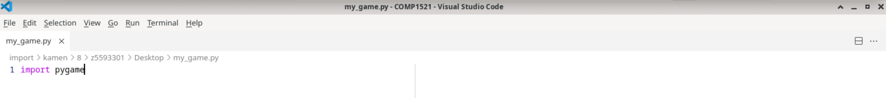
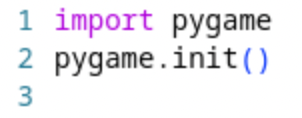

# Task 0.3: Import Pygame
Now that you have created your Python file, it's time to start setting it up for Pygame!

<span style="font-size: 24px;">**Follow these steps:**</span>

## Step 1: Import the Pygame Module

At the very top of your Python file, you need to **import** the Pygame library.

This tells Python:  
*"Hey, I’m going to use Pygame in this project!"*

Type this line at the very top of your file:

```python
import pygame
```

This command loads the Pygame tools into your file, so you can use them for your game!

You should now see something like this:




---

## Step 2: Initialise Pygame

Before we can use any Pygame features (like drawing things and moving characters),  
we need to **initialise** it.

**Initialising** Pygame gets everything ready behind the scenes.

Right underneath your `import pygame` line, type:

```python
pygame.init()
```

`pygame.init()` starts up all the Pygame systems like sound, graphics, timing, etc.

You should now see something like this:



---
# Chckpoint
If you have finished all of these, you can go to Task 1

| Step | Purpose |
|:-----|:--------|
| `import pygame` | Bring in the Pygame library |
| `pygame.init()` | Start all the Pygame systems so you can use them |

Without these two steps, your game won't be able to run!

---

# Great Job!

You are now ready to start building your game screen!

In the next task, we will set up your game window!

<span style="font-size: 24px;">**LET'S GOOOOO!**</span>